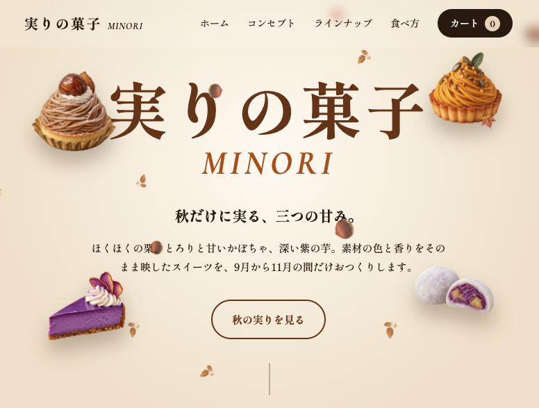

# Portfolio - Sweets Shop

# Over View / 概要

HTML・CSS・JavaScriptの学習を目的として制作した、架空の秋限定スイーツショップのWebサイトです。

*A fictional sweets shop website created for learning and demonstrating HTML, CSS, and JavaScript skills.*

---

## URL

https://turi-kip.github.io/portfolio-shop/

---

## Technologies Used / 使用技術

- HTML
- CSS
- JavaScript

---

## Features / 工夫した点

- Responsive design for desktop and mobile devices.
  - PC・スマートフォンの両方に対応したレスポンシブデザイン

- Interactive product lineup with detailed information.
  - 商品を選択すると、商品の詳細情報を表示するインタラクティブな商品一覧

- Shopping cart functionality with quantity adjustment.
  - 商品の追加・数量変更・削除ができるカート機能

- Product detail modal with ingredients and recommended ways to enjoy each item.
  - 原材料やおすすめの食べ方などを確認できる商品詳細モーダル

- Smooth scrolling navigation and scroll-based animations.
  - スムーズスクロールによるページ内ナビゲーションとスクロール連動アニメーション

- Visual interactions such as floating sweets, falling autumn leaves, and hover animations.
  - スイーツの浮遊や落ち葉、ホバーアニメーションなどの視覚的なインタラクション

- Seasonal color design inspired by chestnuts, pumpkins, and purple sweet potatoes.
  - 栗・かぼちゃ・紫芋をイメージした秋らしい配色とデザイン

---

## Future Improvements / 今後改善したい点

- Add a real payment and order system.
  - 実際の決済・注文システムの実装

- Add product search and category filtering.
  - 商品検索やカテゴリーによる絞り込み機能の追加

- Improve accessibility.
  - アクセシビリティの向上

- Optimize page performance and image loading.
  - ページ表示速度や画像読み込みの最適化

- Add more interactive features to improve the shopping experience.
  - より快適なショッピング体験を実現するためのインタラクティブ機能の追加
